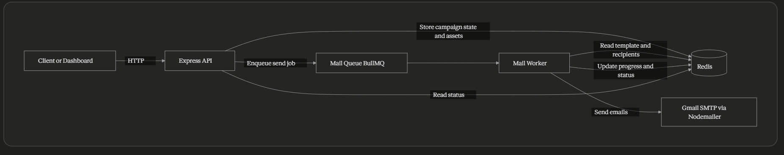

# Mailer

High-throughput bulk email campaign API built with TypeScript.

Mailer is designed for teams that need reliable, asynchronous campaign delivery with simple HTTP workflows and template-based personalization.

## Why Mailer

- Async delivery pipeline powered by BullMQ and Redis.
- Campaign-centric workflow from upload to completion.
- Template placeholders in both subject and HTML body.
- Clear status tracking for operational visibility.
- Minimal integration surface: straightforward REST endpoints.

## Features

- CSV + HTML upload per campaign.
- Recipient validation through mandatory `recipient` column.
- Batched worker processing with retry and exponential backoff.
- Campaign progress metrics (`pending`, `processing`, `completed`, `failed`).
- Structured server and worker logging.

## Stack

- Node.js
- TypeScript
- Express
- BullMQ
- Redis (ioredis)
- Nodemailer

## Quick Start

### 1. Install dependencies

```bash
npm install
```

### 2. Configure environment

Create `.env` in the project root:

```env
PORT=3000

REDIS_HOST=127.0.0.1
REDIS_PORT=6379
REDIS_PASSWORD=

USER_EMAIL=your-email@gmail.com
USER_PASSWORD=your-gmail-app-password
```

### 3. Run in development

```bash
npm run dev
```

API base URL:

```text
http://localhost:3000/api
```

## API

### Health

`GET /health`

### Upload campaign files

`POST /upload` (multipart/form-data)

- `csv`: recipients file with a `recipient` header
- `html`: HTML template file

```bash
curl -X POST http://localhost:3000/api/upload \
  -F "csv=@recipients.csv" \
  -F "html=@template.html"
```

### Start campaign

`POST /send`

```json
{
  "campaignId": "<campaign-id>",
  "from": "sender@example.com",
  "subject": "Welcome {{firstName}}"
}
```

### Preview first recipient render

`POST /preview`

```json
{
  "campaignId": "<campaign-id>"
}
```

### Fetch campaign status

`GET /campaign/:campaignId`

### Delete campaign data

`DELETE /campaign/:campaignId`

## Template Personalization

Placeholders follow `{{columnName}}` and are resolved from CSV headers.

Example CSV:

```csv
recipient,firstName,company
jane@example.com,Jane,Acme
```

Example HTML:

```html
<h1>Hello {{firstName}}</h1>
<p>Welcome to {{company}}.</p>
```

## Local Scripts

```bash
npm run dev
npm run build
npm run start
npm run typecheck
```

## Project Layout

```text
src/
  controller/      request handlers
  routes/          API route definitions
  services/        mail, queues, and workers
  middleware/      error and not-found handlers
  store/           Redis key helpers
  db/              Redis connection setup
  utils/           logger and template utilities
  types/           shared TypeScript interfaces
```

## Architecture



### Processing Flow

1. Client uploads CSV and HTML template to the API.
2. API validates input and stores campaign metadata and assets in Redis.
3. Client starts delivery via `/send`; API pushes a job to BullMQ.
4. Worker consumes the job, renders templates, and sends emails in batches.
5. Worker writes progress and final status back to Redis.
6. Client retrieves campaign status through the status endpoint.

### Reliability Model

- Delivery is asynchronous, so API requests remain fast.
- Jobs are retried automatically with exponential backoff.
- Campaign state is centralized in Redis for real-time status checks.
- Worker concurrency and batch size control throughput and resource usage.
